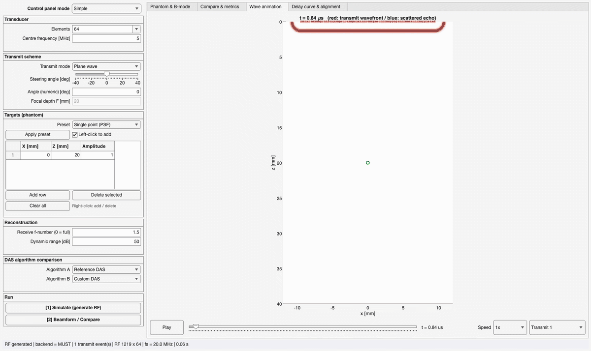

# Ultrasound DAS Beamforming Explorer

An educational and verification GUI for Delay-And-Sum (DAS) beamforming, built
on top of MUST (Matlab UltraSound Toolbox). Change the transducer, the transmit
sequence and the target layout interactively, and **benchmark your own DAS
algorithm against a reference implementation and against MUST's built-in
function**.

No `.mlapp` file is involved: the interface is plain MATLAB code
(`uifigure` / `uigridlayout` / `uiaxes`).

> **Python port.** A faithful Python port lives in [`python/`](python/) —
> same delay laws, reference beamformer, metrics and GUI layout, verified
> against this MATLAB implementation to floating-point precision. It
> implements the analytic mock backend only (MUST is MATLAB-only). MATLAB is
> the source of truth; [`CLAUDE.md`](CLAUDE.md) describes how the two are kept
> in sync.

---

## Demo



What the clip shows, in order: the transmit wavefront expanding and the echo
scattering back on the **Wave animation** tab, then applying a wire-phantom
preset and switching to diverging-wave transmission, running the simulation
(backend: MUST) and beamforming two algorithms side by side, the difference
image / lateral profile / metrics table on the **Compare & metrics** tab,
and finally the exact RF samples a beamformer sums - before and after delay
correction - on the **Delay curve & alignment** tab.

---

## Requirements

| Item | Required | Notes |
|---|---|---|
| MATLAB | yes | R2021a or later recommended (verified on R2025b) |
| Signal Processing Toolbox | optional | Falls back to an FFT-based analytic signal when `hilbert` is unavailable |
| MUST | optional | **Everything works without it** — the engine falls back to an analytic mock backend |

MUST is available from <https://www.biomecardio.com/MUST/>, or run `setup_must`
in this repo to download and add it to the path automatically. MUST is
licensed separately (LGPLv3) and is not bundled here.

---

## Getting started

```matlab
cd <this folder>
main_gui
```

The status bar reports whether MUST was detected. Without it the backend reads
`mock (MUST not found)`; with it, `MUST`.

---

## Files

| File | Role |
|---|---|
| `main_gui.m` | `uifigure`-based user interface |
| `sim_engine.m` | Wraps SIMUS from MUST to generate RF data, with an analytic fallback |
| `das_reference.m` | Textbook DAS reference implementation |
| `das_custom_template.m` | Skeleton for user-written algorithms |
| `wave_animator.m` | Wave propagation, delay curve and alignment drawing |
| `setup_must.m` | Downloads MUST and adds it to the MATLAB path |
| `validation/validate_must_vs_mock.m` | Quantitative mock-vs-MUST agreement check (see below) |
| `validation/validate_execution_trace.m` | Checks a DAS execution trace against its own coherent sum |
| `docs/HW3_DAS.md` | HW3 experiment guide: custom trace hooks and Field II scope |
| `paper/` | LaTeX source of the accompanying arXiv-style paper |
| `python/` | Python port of the tool (mock backend only) + parity tests against MATLAB |
| `CLAUDE.md` | How the MATLAB and Python implementations are kept in sync |

---

## Using the tool

1. **Set the acquisition** in the left column — elements, centre frequency,
   transmit mode (plane / focused / diverging / single element), steering
   angle, focal depth. In **Extreme Simple** mode these are preset for you;
   switch to Simple or Detailed to reach them.
2. **Place the targets** — apply a preset (single point / wire phantom /
   anechoic cyst) or edit the table directly. In the phantom view you can
   **left-click to add** a scatterer and **right-click for an add / delete
   menu**.
3. **Press `[1] Simulate`** to generate the RF data.
4. **Press `[2] Beamform / Compare`** to run algorithms A and B side by side.

### Control panel modes

The **Control panel mode** selector at the top switches between three levels
of detail:

- **Extreme Simple** (the default) — the target position, the speed of sound
  and the dynamic range. Nothing else. Everything the beamformer needs is
  already set up; this mode is for looking at what DAS *does*, not at how the
  acquisition is configured.
- **Simple** — adds elements, centre frequency, transmit mode, steering angle,
  focal depth, receive f-number and the algorithm choice.
- **Detailed** — adds pitch, bandwidth, sampling ratio, diverging-source
  depth, single-element transmit, reconstruction grid size and extent,
  receive apodisation and the custom function name.

Hidden controls keep their values, so **changing mode never changes the
simulation** — it only changes what you can reach.

Because Extreme Simple hides nearly everything, an **Active setup** panel is
visible in every mode and reports what is actually in force: element count,
pitch, aperture, centre frequency, wavelength, pitch in wavelengths,
bandwidth, speed of sound, sampling, receive aperture, transmit scheme, image
extent and dynamic range.

### The default setup, and why

| | value |
|---|---|
| elements | 8 |
| pitch | 0.60 mm (1.95 λ at 5 MHz) |
| aperture | −2.1 … +2.1 mm |
| centre frequency | 5 MHz |
| target | a single point at (0, 10) mm |
| image | −4 … +4 mm, z 3 … 20 mm |
| receive f-number | 0 (full aperture) |

**Eight elements** is the point of the defaults: the delay curve and the
before/after alignment bundles are legible only when you can follow each
channel individually. The receive f-number is 0 to match — at 8 elements an
f-number of 1.5 would leave only two channels active at the target depth.

A sparse array pays for it in **grating lobes**, which appear once the element
spacing exceeds a wavelength. At 0.60 mm the replicas sit at ±31° — about
6 mm off axis at the target depth, outside the 4 mm image — and the Active
setup panel names the condition rather than letting the B-mode just look
broken. Widen the image and they come back into view; that is the array being
honest, not a rendering bug.

Shrinking the pitch further stops helping: the worst off-target level
plateaus around −13 dB, which is the sidelobe floor of a uniform aperture, not
a grating lobe. Only apodisation reaches that floor.

### Tabs

- **Phantom & B-mode** — the phantom layout plus the B-mode images of
  algorithms A and B. Clicking image A moves the analysis point used by the
  delay tab.
- **Compare & metrics** — the difference image `|A - B|`, the overlaid lateral
  profiles with their FWHM, and a metrics table (run time, peak position,
  FWHM, MSE, maximum absolute error).
- **Wave animation** — the transmit wavefront (red) and the scattered echoes
  (blue). Receive elements light up as the echo reaches them. Playback is
  paced against real time; at 1x one full sweep takes about 20 seconds, and
  the speed selector offers 0.25x to 4x.
- **Delay curve & alignment** — four panels read left to right as one
  picture:
  1. **B-mode A** — click or drag to choose the pixel being reconstructed.
  2. **Delay curve** — the RF data with the samples DAS sums for that pixel
     drawn on top, on *the same frame as the B-mode beside it*: element
     position in mm across, apparent depth `c·t/2` in mm down, same limits and
     same aspect. The pixel carries the B-mode's own marker, so the two panels
     pair up by eye.
  3. **Before alignment** — those samples as a waveform bundle, scattered in
     time along the delay curve.
  4. **After alignment + sum** — the same bundle delay-corrected into phase,
     with the coherent sum beside it.

  The depth axis of panel 2 is an *apparent* depth: `tau` covers transmit plus
  receive, so the curve meets the pixel marker only when the two legs are
  equal. That holds for an unsteered plane wave; steer it, or focus it, and
  the whole curve sits off by the difference. The offset is physical, which is
  why the axis is labelled `c t / 2` rather than `z`.

- **DAS execution replay** — the recorded execution of the selected
  beamformer: the actual per-channel contributions at the summation site, the
  coherent accumulation along a scan line, and the envelope it returns. See
  [`docs/HW3_DAS.md`](docs/HW3_DAS.md) for the trace hook your own
  implementation should keep.

---

## Verifying your own DAS algorithm

### Unified interface

```matlab
[bmode_img, delays] = my_das(rf_data, tx_info, rx_pos, grid_x, grid_z, sound_speed, fs)
```

| Argument | Type / size | Meaning |
|---|---|---|
| `rf_data` | `[Nt x Nel]` | RF data. **Time along the first dimension**, columns are receive elements |
| `tx_info` | struct | Transmit settings (see below) |
| `rx_pos` | `[1 x Nel]` | Receive element x coordinates [m]; authoritative for the receive geometry |
| `grid_x`, `grid_z` | vectors | Reconstruction axes [m]; expanded internally with `meshgrid` |
| `sound_speed` | scalar | Speed of sound [m/s] |
| `fs` | scalar | Sampling frequency [Hz] |

| Return value | Type / size | Meaning |
|---|---|---|
| `bmode_img` | `[numel(grid_z) x numel(grid_x)]` | **Linear envelope** (no log compression) |
| `delays` | `[Npix x Nel]` | **Total two-way time [s]** per pixel and element; `NaN` where not summed. Skip it when `nargout < 2` |

Main fields of `tx_info`:

| Field | Meaning |
|---|---|
| `delays` | `[1 x Nel]` transmit delays [s] (`NaN` on inactive elements, normalised so `min(active) = 0`) |
| `apod` | `[1 x Nel]` transmit apodisation (`0` when inactive) |
| `elem_x`, `elem_z` | Transmit element coordinates [m] |
| `t0` | Time of the first RF sample [s] |
| `fnumber` | Receive f-number (`0` = full aperture). The unified interface has no argument for it, so it travels here |
| `rx_apod` | `'rect'` or `'hann'` |
| `scheme`, `angle_deg`, `focus_mm`, `src_xz` | Transmit settings, including the focal point / virtual source coordinates |

### Steps

1. Copy `das_custom_template.m` to e.g. `my_das.m` and rename the function to
   match the file.
2. Edit `[STEP 1]` ... `[STEP 5]`.
3. Switch the control panel to **Detailed**, type `my_das` into
   **Custom function name**, and select `Custom DAS` as algorithm A or B.

If the returned size violates the contract, `main_gui` reports it with a
specific error message.

**Out of the box** the template implements a naive DAS (nearest-neighbour
sampling with a rectangular apodisation). Comparing it with the reference
implementation (linear interpolation) shows the interpolation error as a
raised sidelobe floor in the difference image and the lateral profile.

---

## Definition of the metrics

- **B-mode images are passed around as linear envelopes**; `20*log10` is
  applied only for display. MSE and FWHM are only meaningful on linear values.
- **The difference image and the MSE normalise both images by the maximum of
  A**. Normalising each image separately would hide gain differences.
- **FWHM** is the **-6 dB (half-amplitude) full width of the linear envelope**,
  with the crossings located by linear interpolation for sub-pixel accuracy.
  It is not "half the value" on the dB image.
- **Run time** is measured after a throwaway call on a tiny grid (JIT warm-up),
  and the timed call requests a single output so computing `delays` does not
  inflate the result.
- FWHM is only meaningful for the single-point (PSF) preset. For wire and cyst
  phantoms the row of the global maximum is used, so treat it as indicative.

---

## Notes on the transmit modes (intended behaviour)

- **A focused transmit is a single scan line.** No lateral sweep is performed,
  so targets off the beam axis appear as arc-shaped artefacts. This is the
  physical consequence of a single focused firing, not an implementation bug.
  Use the plane-wave or diverging modes to image off-axis targets correctly.
- **Multi-focus** (several comma-separated focal depths) generates one transmit
  event per depth and **composites the image zone by zone in depth**. Each zone
  is envelope-detected independently, so a faint seam (Hilbert edge effect)
  appears at the zone boundaries. If a zone ends up shorter than 4 rows, that
  band degrades to `abs()` instead of a proper envelope, so keep the number of
  focal depths to about three or four for the usual depth resolution.
- Two models are used for the transmit arrival time:
  - plane / diverging / single element -> first-arrival (Huygens) model
    `min_e(delay_e + |p-e|/c)`, which is exactly equal to the closed forms;
  - focused -> virtual-source model `T_F +/- |p-F|/c`, because the
    first-arrival model latches onto the weak edge wave from the aperture rim
    beyond the focus.

---

## Backends

### MUST backend

All MUST-specific code lives inside the `runMUST` function of `sim_engine.m`.
The syntax used is the following (checked against the official MUST
documentation):

```
RF = SIMUS(X, Z, RC, DELAYS, PARAM)   % 2-D syntax; RF has one column per element
BFSIG = DAS(SIG, X, Z, DELAYS, PARAM) % MUST's built-in DAS, used for comparison
```

- The time origin is `t = 0`; `sim_engine` reports it explicitly as `out.t0`.
- Transmit delays are computed inside this tool rather than with MUST's
  `txdelay`, so the delay law itself can be read as teaching material.
- If a future MUST release changes the argument order, only `runMUST` needs
  editing.

### Mock backend

Without MUST, the RF data is synthesised with an analytic 2-D cylindrical-wave
model:

1. the spherical waves radiated by all active transmit elements are
   superimposed to build the field at each scatterer, and
2. that field is propagated back to every receive element and added to the RF
   matrix.

Diffraction, element directivity and frequency-dependent attenuation are not
modelled rigorously, but **the delay structure is physically exact**, which is
what matters when verifying the alignment performed by a DAS beamformer.
Reconstructing a point scatterer places the peak within one grid cell of the
truth for plane, focused, diverging and single-element transmits, across
16 / 32 / 64 / 128 elements and sampling ratios of 4 and 8.

---

## Validation against MUST

`validation/validate_must_vs_mock.m` runs both backends on identical
transmit/target setups and compares (a) the raw RF channel data via
normalized cross-correlation and (b) the beamformed images. Requires MUST
(`setup_must`) and takes about a minute (plus MUST's ~20 s one-time
per-session initialization). Results are written to `validation/results/`
(`.csv`, `.mat`, and two figures) and are the numbers reported in the
accompanying paper (`paper/paper.pdf`). Summary, across 7 cases spanning all
three transmit schemes, 16/64/128-element probes, and on-/off-axis targets:

| Metric | Result |
|---|---|
| Timing alignment (`t0`) | Both backends place the envelope peak within 0.5 samples of the geometric round-trip time (mock +0.51, MUST -0.49 samples) - no large bias |
| Raw-RF per-channel correlation | 0.89 - 0.94 (mean 0.92); lower for larger apertures (128 el.) |
| Raw-waveform cross-correlation lag | Constant ≈ -1.0 sample (≈ -50 ns, confirmed sub-sample via parabolic interpolation - see `validation/calibrate_lag_sign.m` for how the sign was pinned down empirically). This is the opposite sign from the `t0` row above, and that is expected, not a contradiction: the `t0` check tracks the pulse *envelope* (group delay), while this tracks alignment of the *carrier oscillations* (phase) in the raw waveform. The two only have to agree if the two backends' pulses are exact time-shifted copies of each other, and they are not (§ below) - both magnitudes are ~1 sample (~50 ns), a quarter of the 200 ns carrier period at 5 MHz, well under anything that would visibly shift an image |
| Beamformed peak position | Both backends agree with the known target and with each other to within about one lateral grid cell (≤ 0.14 mm at 12.5 µm grid spacing) |
| Lateral FWHM, plane/diverging | Mock and MUST agree to within ~10-20% |
| Lateral FWHM, focused (on-axis) | Mock is ~2.6x narrower than MUST (0.10 vs. 0.26 mm, confirmed converged at grid spacings from 125 µm to 1.25 µm). A rule-of-thumb diffraction estimate ((f-number)×λ ≈ 1.5×0.308 mm ≈ 0.46 mm) is already looser than MUST's value and roughly 4-5x looser than the mock's - i.e. the mock's mainlobe is tighter than a simple diffraction bound allows, independent of trusting MUST as ground truth. Attributed to the mock's missing element directivity and finite-aperture diffraction |
| Lateral FWHM, 16-element probe | Mock is *wider* than MUST here (2.04 vs. 1.61 mm) - the opposite direction from the focused-on-axis row above. This is a different regime, not the same effect: a 16-element, 0.30 mm-pitch array is only 4.5 mm wide, short of the 13.3 mm an f/1.5 receive aperture would want at 20 mm depth, so the aperture is clipped to the full array (effective f-number ≈ 4.4). We did not investigate this regime's mock-vs-MUST discrepancy further |

Read this as: **the mock backend is a faithful, timing-accurate stand-in for
verifying DAS delay-and-sum logic**, but it is not a substitute for MUST (or a
full diffraction simulator) if the point of the exercise is realistic
image-quality or resolution assessment - focused-transmit lateral resolution
in particular should not be trusted quantitatively from the mock backend.

---

## Citing this work

If this tool is useful in teaching or research, please cite it - see
[`CITATION.cff`](CITATION.cff) or the draft paper in [`paper/`](paper/). This
project is MIT-licensed (see [`LICENSE`](LICENSE)); MUST itself is licensed
separately under LGPLv3 by its authors.
