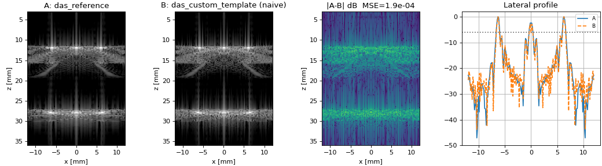

# Ultrasound DAS Beamforming Explorer — Python port

A faithful Python port of the MATLAB [Ultrasound DAS Beamforming
Explorer](../README.md). Same delay laws, same reference beamformer, same
metrics, same interactive GUI layout — verified against the MATLAB
implementation to floating-point precision (`rtol = 1e-9`).

**MATLAB is the source of truth.** See [`../CLAUDE.md`](../CLAUDE.md) for the
rule that keeps the two in lock-step.



## Scope vs. the MATLAB tool

| MATLAB feature | Python |
|---|---|
| Analytic **mock** RF backend | ✅ ported, numerically identical |
| `das_reference`, `das_custom_template`, metrics, wave animation, delay/alignment views | ✅ ported |
| Interactive GUI (5 tabs, editable phantom table, wall-clock-paced animation) | ✅ ported (Tkinter + Matplotlib) |
| Three control-panel modes, `Active setup` readout, DAS execution replay | ✅ ported |
| **MUST (SIMUS) backend** and the `MUST das()` algorithm | ❌ MATLAB-only — MUST has no Python port |
| `validation/`, `paper/` | ❌ MATLAB-only |

Widget APIs differ by necessity — `uifigure`/`uigridlayout`/`uiaxes` in MATLAB
against `tk.Tk`/`ttk`/Matplotlib here — so the port matches **structure and
behaviour, not widget for widget**. Where Matplotlib needs a nudge MATLAB does
not (title font sizes on the four-panel delay tab, for instance), that lives on
the Python side only.

## Install

```bash
cd python
pip install -e ".[gui,test]"     # or: pip install numpy scipy matplotlib
```

Requires Python ≥ 3.9. The GUI needs `matplotlib` (TkAgg) and the `tkinter`
stdlib module.

## Run the GUI

```bash
python -m ultrasound_das          # or: ultrasound-das-gui
```

1. Set the acquisition in the left column (elements, centre frequency, transmit
   mode, steering angle, focal depth). The default **Extreme Simple** mode
   presets all of it — switch modes to reach it.
2. Apply a phantom preset or edit the table (double-click a cell; left-click the
   phantom axes to add a scatterer).
3. **[1] Simulate** to generate RF data.
4. **[2] Beamform / Compare** to run algorithms A and B side by side.

The **Control panel mode** selector offers **Extreme Simple** (target position,
speed of sound, dynamic range only), **Simple** and **Detailed**, exactly as in
MATLAB. Hidden controls keep their values, so changing mode never changes the
simulation. The **Active setup** panel stays visible in every mode and reports
what is actually in force, including a grating-lobe warning when the pitch
exceeds a wavelength.

The defaults match MATLAB: 8 elements at 0.60 mm pitch, 5 MHz, a single target
at (0, 10) mm, imaged over −4…+4 mm and z 3…20 mm at full receive aperture.
[The MATLAB README](../README.md#the-default-setup-and-why) explains why.

## Use as a library

```python
import numpy as np
from ultrasound_das import SimConfig, sim_engine, das_reference, recon_grid, compare_images

S = sim_engine(SimConfig(scheme="focused", focus_mm=20,
                         scat_x=[0, 4e-3], scat_z=[18e-3, 26e-3], scat_rc=[1, 1]))
gx, gz = recon_grid(x_half_mm=12, nx=161, z_max_mm=40, nz=221)
img, delays = das_reference(S.RF[:, :, 0], S.tx[0], S.rx_pos, gx, gz, S.c, S.fs,
                            want_delays=True)
```

### Writing your own beamformer

Copy [`ultrasound_das/das_custom_template.py`](ultrasound_das/das_custom_template.py),
keep the signature

```python
def my_das(rf_data, tx_info, rx_pos, grid_x, grid_z, sound_speed, fs, want_delays=False): ...
```

and return a linear-envelope image of shape `(len(grid_z), len(grid_x))`
(pixels column-major, i.e. `img.ravel(order="F")`). In the GUI (Detailed mode)
put `your_module:my_das` into **Custom module:function** and pick **Custom DAS**
as algorithm A or B.

## Tests

```bash
python tests/test_parity.py       # vs. golden MATLAB fixtures (rtol 1e-9)
python tests/test_contract.py     # interface contract, no MATLAB needed
python tests/test_trace.py        # DAS execution-trace hook
# or, with pytest installed:
pytest
```

`test_contract.py` also pins the numeric parts of the delay/alignment views
that have no MATLAB fixture — the channel-count-dependent bundle gain, the
alignment window widening to hold the delay spread, and the `c·t/2` mapping
that lets the delay panel share the B-mode's frame.

Regenerate the golden fixtures after any MATLAB numeric change:

```bash
matlab -batch "run('parity/dump_reference.m')"
```

## DAS execution replay

`[2] Beamform / Compare` also records the selected beamformer's execution: the
actual per-channel contributions at the summation site, the coherent
accumulation along a scan line, and the envelope it returns. Keep the trace
hook in your own implementation (`want_trace=True`) — see the
[HW3 experiment guide](../docs/HW3_DAS.md).
